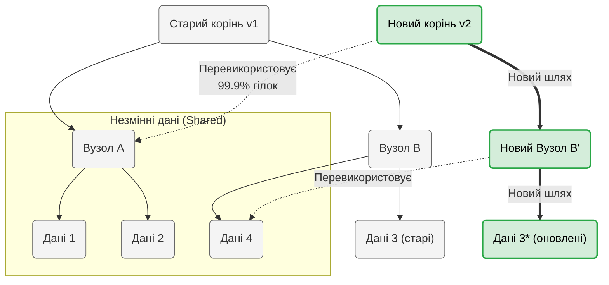

# Лекція 01. Основи ФП, Незмінність (Immutability) та парадокс "копіювання"

## Питання для розминки

1. **Як операції вводу/виводу (I/O — мережа, диск, клавіатура) ускладнюють життя інженера при використанні коду?**
   <details markdown="1">
   <summary>Відповідь</summary>
   
   Будь-який I/O робить функцію непередбачуваною. Якщо код напряму лізе в базу даних або робить HTTP-запит, його результат залежить від зовнішнього світу (який може "впасти" або змінити дані). Щоб протестувати таку функцію, доводиться писати складні моки (Mocks) або піднімати тестові БД. У Функціональному програмуванні всі такі операції називають **побічними ефектами (side effects)** і намагаються ізолювати.
   </details>

2. **Згадайте математику: функція $y = f(x)$ ніколи не змінює сам $x$ і не впливає на навколишній світ. Чому ж у класичному програмуванні ми звикли постійно змінювати стан об'єктів?**
   <details markdown="1">
   <summary>Відповідь</summary>
   
   Це історична спадщина. Перші комп'ютери (архітектура фон Неймана) мали критично мало пам'яті, тому найефективнішим способом було перезаписувати дані в одних і тих самих комірках (змінний стан). Сьогодні пам'ять дешева, але процесори стали багатоядерними, а системи — кластерними. Тепер саме цей змінний стан є головною причиною багів у розподілених обчисленнях. ФП просто повертає програмування до математичної чистоти: дані незмінні, а функції лише обчислюють новий результат.
   </details>

3. **Простими словами: що таке "обчислення" (computation)?**
   <details markdown="1">
   <summary>Відповідь</summary>
   
   Ви бачили, як професійний бариста готує сучасне капучино? У нього є ваги (до десятих грама), термометр для молока, таймер і дуже строга послідовність дій (алгоритм). Головна умова "обчислення": кожен крок має бути настільки чітким і однозначним, що для його виконання взагалі не потрібні розум, натхнення чи фантазія. Якщо просто механічно виконати всі кроки за інструкцією — ви гарантовано отримаєте ідеальну чашку кави (результат). Саме це намагалися формалізувати математики у 1930-х: як розкласти будь-яку задачу на послідовність абсолютно "бездумних" механічних дій.
   </details>

## 0. Історія: Парадигма, яка чекала 70 років

У 1928 році видатний математик Давид Гільберт кинув виклик науковому світу (проблема розв'язності, нім. *Entscheidungsproblem*, англ. *decision problem*): чи існує універсальний "механічний" алгоритм, який міг би гарантовано довести або спростувати будь-яке математичне твердження? Щоб відповісти на це абстрактне питання, вченим довелося спочатку суворо визначити — а що взагалі означає "механічно обчислити"?

Так у **1936 році** в спробах дати математичне визначення комп'ютерному алгоритму світ обчислень розділився на дві гілки:
1. Майже одночасно і абсолютно незалежно, молодий британський математик **Алан Тюрінг** (який лише згодом став аспірантом Черча) вирішив ту саму проблему. Але він придумав абстрактну "Машину Тюрінга" — пристрій, який крок за кроком змінює стан комірок на нескінченній стрічці. Це стало базою імперативного програмування.
2. **Алонзо Черч** створив **лямбда-числення** (розділ математичної логіки). *(До речі, чому "лямбда"? Черч позначав аргументи функцій "дашком" $\hat{x}$, але друкарням було важко це набирати. Знак опустили перед змінною $\wedge x$, і згодом він візуально еволюціонував у грецьку літеру $\lambda$)*. Він визначив "обчислення" як перетворення абстрактних математичних функцій, що стало базою для ФП.

Вони довели, що обидва підходи абсолютно еквівалентні (Теза Черча-Тюрінга). Але коли у **1945 році** **Джон фон Нейман** проектував перші електронні комп'ютери (архітектуру EDVAC), він обрав модель Тюрінга. 

**Чому?** Фізичні компоненти (радіолампи, а пізніше транзистори) за своєю природою мають стан — вони або тримають заряд (1), або ні (0). Модель Тюрінга ідеально лягала на фізику: комп'ютер просто читав заряд і перезаписував його (мутував стан комірки). Натомість лямбда-числення Черча працює як алгебра: воно вимагає підстановки виразів замість змінних та постійного створення нових копій даних. Зробити такий механізм динамічного виділення пам'яті та копіювання прямо "в залізі" на технологіях 1940-х років було неможливо.

Так архітектура фон Неймана на півстоліття наперед визначила домінування імперативних мов (С, С++, Java). Хоча перша мова ФП — **LISP** — з'явилася ще у 1958 році (так, дослідження штучного інтелекту почалися ще у 1950-х роках, і весь сучасний ШІ повністю базується на математиці минулого століття!). Її створив **Джон Маккарті** спеціально для потреб ШІ, бо йому потрібна була мова для обробки абстрактних символів, а не лише чисел. Але LISP був приречений працювати на "ворожому" імперативному залізі, тому ФП довго залишалося суто академічною іграшкою.

> **Цікавий факт: Сучасний ШІ — це тріумф Функціонального Програмування**
> 
> Сучасні великі мовні моделі (LLM) та нейронні мережі працюють завдяки інфраструктурі, що глибоко пронизана принципами ФП:
> - **Незмінність (Immutability):** Нейромережі оперують багатовимірними масивами чисел (тензорами). Під час обчислень старі тензори ніколи не мутують — замість цього математично обчислюються і повертаються абсолютно нові тензори. Тільки завдяки цій незмінності алгоритми Deep Learning можна безпечно розпаралелити на тисячі відеокарт (GPU/TPU) одночасно.
> - **Чисті функції (Pure Functions):** Кожен шар нейромережі — це математична функція без побічних ефектів та прихованого стану. Це дозволяє компіляторам агресивно оптимізувати виконання.
> - **Фреймворк JAX (Google DeepMind):** Велика частина передових розробок ШІ сьогодні створюється на JAX (Python). Його головна вимога — код має бути написаний у строго функціональному стилі. Лише чисті функції JAX здатний скомпілювати (через XLA) у надзвичайно швидкий машинний код.
> 
> Метафорично кажучи, "мозок" сучасного штучного інтелекту функціонує за законами імперативного заліза фон Неймана, але його "душа" та математика — це чиста спадщина Алонзо Черча та лямбда-числення.

**Чому ФП не "вистрілило" одразу?**
1. **Слабке залізо.** ФП вимагає незмінності даних, а отже — постійного виділення пам'яті під їхні копії. У 1970–90-х оперативна пам'ять коштувала космічних грошей. Імперативні мови (С/С++) перемогли, бо дозволяли економити кожен байт, жорстко перезаписуючи старі комірки пам'яті (мутуючи стан).
2. **Академічний снобізм.** Замість вирішення реальних інженерних задач, творці чистого ФП (наприклад, Haskell) глибоко занурилися в абстрактну математику. Вони притягнули в програмування **Теорію категорій** — складний розділ вищої алгебри. Терміни на кшталт "Монада" чи "Ендофунктор" просто лякали звичайних розробників, створивши міф, що для ФП треба мати науковий ступінь.

**Що змінилося? (Точка перетину)**
У середині 2000-х років частота процесорів вперлася у фізичні ліміти тепловіддачі. Замість процесорів на 10 ГГц ми отримали 4, 8, а потім і 16 ядер. Настала ера **багатопоточності, розподіленості та хмарних кластерів**. 

Раптом виявилося, що спільний змінний стан (який раніше економив пам'ять) — це ідеальний рецепт для Deadlocks та Race conditions. Пам'ять стала дешевою, а от час розробників на виловлювання плаваючих багатопотокових багів — неймовірно дорогим. Саме тоді індустрія (Twitter, LinkedIn, Netflix) відкрила для себе гібридні мови на кшталт Scala (яку створив професор **Мартін Одерські**, елегантно поєднавши об'єктно-орієнтований та функціональний підходи на базі JVM). Виявилося, що ідеї Алонзо Черча з 1930-х років ідеально вирішують проблеми розподілених систем 21-го століття: **немає змінного стану — немає проблем із паралелізмом**.

---

**Відкрите питання:** Чому, коли ми вперше говоримо про Функціональне програмування та відмову від змінного стану, у будь-якого інженера з досвідом у С++ або Java виникає миттєвий скепсис?

Але перш ніж розвіювати міфи, давайте зафіксуємо базові поняття.

## 1. Що таке Функціональне Програмування (ФП)?

**Функціональне програмування** — це парадигма, де програми будуються шляхом математичної композиції функцій, а не через зміну стану об'єктів.

### Ключові стовпи
- **Чисті функції (Pure Functions):** Це основа ФП. Щоб функція вважалася чистою, вона має відповідати двом суворим ознакам:
  1. **Тотальність та Детермінованість:** При однакових вхідних аргументах функція *завжди* повертає однаковий результат. Вона не залежить від глобальних змінних, часу чи випадкових чисел.
  2. **Відсутність побічних ефектів (No Side Effects):** Функція нічого не змінює у зовнішньому світі. Вона не пише в базу даних, не виводить текст на екран (`println`), не кидає винятків (Exceptions) і не мутує вхідні аргументи. 
  *(Завдяки цим ознакам чисті функції мають властивість **Посилальної прозорості (Referential Transparency)** — будь-який виклик функції можна безпечно замінити на її готовий результат без зміни поведінки програми).*
- **Незмінність (Immutability):** Створені дані не можна змінити. Щоб їх оновити, ви повертаєте нову копію з відповідними змінами. 
- **Функції вищого порядку:** Функції — це повноцінні об'єкти (first-class citizens). Їх можна передавати як аргументи або повертати як результат.
- **Конвеєри (Pipelines):** Складні задачі вирішуються елегантно: вихід однієї функції миттєво стає входом для наступної.

### Чому індустрія переходить на ФП? (Переваги)
- **Передбачуваність:** Код без прихованого стану і раптових ефектів не підкидає "сюрпризів".
- **Легке тестування:** Чисту функцію ідеально тестувати (Unit Tests), адже вам не потрібні громіздкі моки чи підняття баз даних.
- **Безпечна багатопоточність (Concurrency):** Незмінні дані неможливо "зламати" одночасним доступом. Паралельне програмування стає безпечним за замовчуванням (без дедлоків та race conditions).
- **Чіткість коду:** Замість викидання винятків (Exceptions), які ламають логіку програми, ФП використовує явні типи-результати (як-от `Option` ("є значення або нічого") або `Either` ("успіх або помилка")). Ваш код завжди чесний.
  - **ООП (нечесний контракт):** `def findUser(id: String): User` — сигнатура бреше. Вона обіцяє повернути `User`, але може повернути `null` або викинути `UserNotFoundException`. Про це ми дізнаємося лише під час виконання (в Runtime).
  - **ФП (чесний контракт):** `def findUser(id: String): Option[User]` — компілятор на етапі збірки змушує розробника явно обробити випадок відсутності користувача. Програма не впаде через несподіваний виняток.

### Виклики (Чому це буває боляче?)
- **Крутий поріг входження:** Зламати імперативне мислення — це найважчий крок. Спочатку вам здаватиметься, що ви вчитеся програмувати наново.
- **Академічний жаргон:** Спільнота ФП обожнює математичні терміни (*монади, ендофунктори, моноїди*), що часто відлякує новачків від дуже простих ідей.
- **Практичність:** Взаємодія з реальним світом (який за своєю природою має мінливий стан) вимагає опанування специфічних архітектурних патернів.

### Мови програмування у світі ФП
- **Чисто функціональні:** Haskell (золотий стандарт строгості).
- **Гібридні (Наш вибір):** **Scala**, F#, OCaml. Поєднують міць ФП із багатими ООП екосистемами (як-от JVM або .NET).
- **Інші:** Elixir, Erlang, Clojure — прекрасні мови для паралельних систем. Rust — хоч і системна мова, але активно використовує ФП-концепти (типи Result/Option) та жорсткий контроль пам'яті.

---

## 2. Парадокс "копіювання" даних

У попередній лекції ми сказали фундаментальну річ: **замість того, щоб змінювати існуючий об'єкт, ми завжди створюємо його нову копію зі змінами.**

### У чому проблема для класичного ООП-інженера?
Якщо ви прийшли з С++ або Java, ваш мозок одразу малює катастрофу:
- "Копіювати величезну колекцію на кожен чих?"
- "Це ж миттєво з'їсть усю оперативну пам'ять!"
- "А що з процесором та Garbage Collector? Система задихнеться від такої кількості сміття!"

Для класичного імперативного мислення повне копіювання масиву на мільйон елементів заради зміни одного — це найгірший антипатерн, який робить систему непридатною для Highload. Через це багато інженерів помилково вважають ФП суто "академічною іграшкою", відірваною від реальності.

### Як це працює насправді: Structural Sharing

Секрет у тому, що функціональні мови програмування та їхні колекції під капотом **ніколи не копіюють всю структуру цілком**. Вони використовують концепцію **Structural Sharing** (структурне перевикористання).

Оскільки в парадигмі ФП дані є **незмінними** (immutable), ми можемо абсолютно безпечно перевикористовувати існуючі блоки пам'яті для нових структур, не боячись, що хтось їх змінить.

#### Практика створення нових даних: синтаксичний приклад `.copy()`

Як це виглядає в коді? Подивимося на класичний приклад з об'єктом у Scala.

```scala
case class User(name: String, age: Int, email: String)

val userV1 = User("Alex", 25, "alex@example.com")

// Замість мутації полів (заборонено): userV1.age = 26
// Створення нового об'єкта через метод copy:
val userV2 = userV1.copy(age = 26)
```

**Що тут відбулося "під капотом"?**
- Старий об'єкт `userV1` залишився **абсолютно недоторканим**. Якщо інші потоки прямо зараз його читають, вони в повній безпеці.
- Новий об'єкт `userV2` отримав нове значення `age`. Але для полів `name` та `email` він не дублював байти тексту в пам'яті! Він просто **перевикористав посилання** на вже існуючі рядки старого об'єкта. Це і є найпростіший вид Structural Sharing.

#### Приклад: Однозв'язний список

Уявіть старий список:
`List1: [A] -> [B] -> [C] -> [D]`

Якщо ми хочемо створити новий список, додавши елемент `[X]` на початок, ми не дублюємо весь список. Ми створюємо лише один новий вузол `[X]` і кажемо, що його наступним елементом є голова старого списку.

`List2: [X] -> [A] -> [B] -> [C] -> [D]`

При цьому `List1` продовжує безпечно існувати. Обидва списки спільно використовують пам'ять для елементів від `A` до `D`.

#### Приклад: Дерева та O(log N)

Для складніших колекцій (як-от Hash Map чи Vector у Scala) використовуються дерева. Якщо вам потрібно змінити один елемент у колекції з мільйона записів:
1. Створюється копія лише того шляху (від кореня дерева до зміненого вузла), де відбулася зміна. Це займає логарифмічний час $O(\log N)$, тобто лічені операції.
2. **99.9% старої структури дерева просто перевикористовується.** На ці старі незмінні гілки просто з'являються посилання з нових вузлів.



Ця ілюстрація наочно пояснює, чому створення "нової" колекції на 1 000 000 елементів вимагає аллокації всього кількох об'єктів у пам'яті. "Магія" зникає: ми не копіюємо мільйон значень, ми створюємо лише новий шлях, а всі інші гілки продовжують вказувати на старі незмінні вузли.

### Що це означає для нас?
Використання пам'яті у ФП — це не дублювання байтів. Це створення **нових вказівників на існуючі незмінні дані**. Цей підхід дозволяє створювати надзвичайно швидкі та ефективні системи без "Race conditions", розв'язуючи головну проблему паралелізму без втрати продуктивності.

### Прагматизм та "ціна" незмінності (GC & Overhead)

Попри всю елегантність структурного перевикористання, ми маємо залишатися прагматиками і пам'ятати про інженерні компроміси. Structural Sharing не дається безкоштовно:

1. **Промахи кешу процесора (Cache Misses):** Навіть якщо пошук у дереві займає $O(\log N)$, перехід за вказівниками на розкидані в пам'яті вузли вимагає додаткових циклів CPU. У С++ звернення до масиву за адресою — це $O(1)$, і дані зазвичай вже лежать у надшвидкому L1/L2 кеші.
2. **Тиск на Garbage Collector:** Створення мільйонів короткоживучих проміжних вузлів для кожного дрібного оновлення створює навантаження на систему збирання сміття. У високонавантажених системах це може призводити до мікропауз (GC Pauses).

**Золоте правило інженера-прагматика:**
> Локально, всередині критичної за продуктивністю функції, ми маємо повне право мутувати звичайний масив. Але назовні ми зобов'язані експонувати виключно чистий та **immutable-інтерфейс**.

Це дозволяє зберегти ідеальну архітектуру всієї програми, не втрачаючи швидкості у "вузьких" математичних розрахунках.

## 3. Архітектурний патерн "Functional Core, Imperative Shell"

Ми вже з'ясували, що чисті функції не мають побічних ефектів, а взаємодія з реальним світом (БД, мережа) виштовхується на "окраїни архітектури".

Але тут у студента часто виникає **парадокс**: *"Якщо моя програма не робить I/O і нічого не пише в БД, то як вона взагалі працює і кому вона потрібна?"*. Справді, програма без I/O — це просто обігрівач для процесора.

Щоб вирішити цей парадокс, індустрія використовує патерн **Functional Core, Imperative Shell** (Функціональне ядро, Імперативна оболонка). Його суть найкраще описати простою тришаровою схемою:

1. **Imperative Shell (Зовнішній шар — Вхід):** Відповідає за брудну роботу. Він отримує HTTP-запит, йде в базу даних, дістає звідти потрібні для операції дані і передає далі.
2. **Functional Core (Чисте ядро):** Отримує ці дані як **незмінні параметри (immutable)**. Саме тут живе вся найскладніша бізнес-логіка, перевірки та обчислення (чиста математика без I/O). Ядро не знає про базу даних — воно просто обчислює і повертає **новий об'єкт-результат**.
3. **Imperative Shell (Зовнішній шар — Вихід):** Отримує обчислений результат від ядра і знову робить I/O: зберігає оновлення в БД або відправляє відповідь клієнту.

**Що це дає?** 
Це показує, де саме живе ФП у реальних сервісах і знімає страх перед "чистотою". Ваша найскладніша бізнес-логіка надійно захована в ядрі, де її можна тестувати миттєво та на 100% (без моків і тестових БД). А всі I/O-ефекти залишаються у тонкому зовнішньому шарі.

---

## Контрольні питання

1. **Чому структурне копіювання (Structural Sharing) є набагато ефективнішим, ніж звичайне копіювання масиву в C++ або Java?**
   <details markdown="1">
   <summary>Відповідь</summary>
   
   Тому що ФП-колекції під капотом часто реалізовані як дерева. При додаванні або зміні елемента копіюється лише шлях від кореня до цього елемента (що вимагає O(log N) операцій). Решта 99% структури просто перевикористовується новими вказівниками, оскільки всі дані є незмінними.
   </details>

2. **Яку головну проблему багатопоточності вирішує концепція Immutability?**
   <details markdown="1">
   <summary>Відповідь</summary>
   
   Вона автоматично усуває стан гонитви (Race conditions) та необхідність використання блокувань (Locks). Якщо дані не можна змінити після створення, тисячі потоків можуть безпечно читати їх одночасно, не ризикуючи отримати неузгоджений стан.
   </details>
