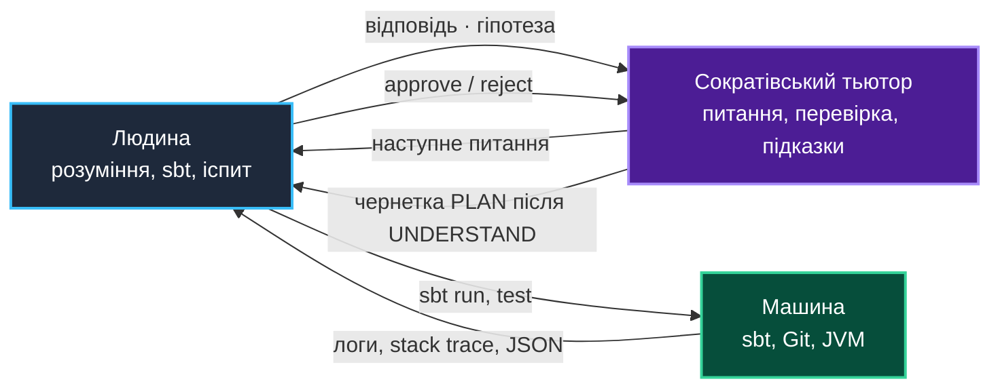
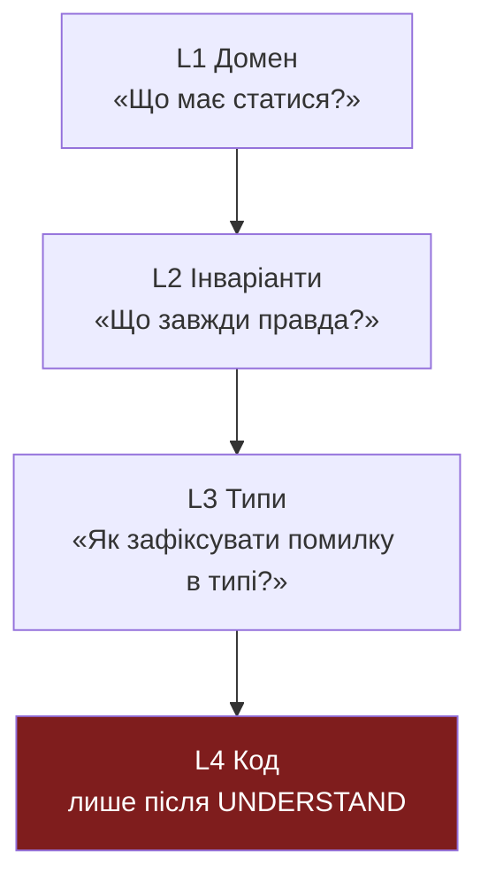

# Практика 00: Сократівський тьютор — як вчитися ФП з ШІ, не втрачаючи розуміння

> **Декларація курсу.** Академічна доброчесність та авторство матеріалів — у [DISCLAIMER.md](DISCLAIMER.md).

Практика 0 навчає **сократівського** режиму взаємодії з LLM: ШІ ставить запитання, ви формулюєте відповідь, а код з'являється лише тоді, коли ви можете пояснити архітектурне рішення власними словами. На іспиті кнопки «згенерувати» не буде.

### Чому саме сократівський тьютор, а не «зроби лабу»

| Режим | Що відчуває студент | Що на захисті / іспиті |
| :--- | :--- | :--- |
| **Vibe-coding** | Швидко, приємно, тести зелені | «Поясніть рядок 47» → пауза → провал |
| **Сократівський тьютор** | Повільніше на старті, глибокі запитання | Ви вже відповіли на ці питання в діалозі — тож упевнено захистите рішення |

> **Чому «сократівський»?** У V ст. до н. е. [Сократ](https://uk.wikipedia.org/wiki/%D0%A1%D0%BE%D0%BA%D1%80%D0%B0%D1%82) в Афінах майже не читав лекцій із готовими відповідями. Він ставив серію послідовних уточнювальних запитань — щоб співрозмовник сам виявив суперечності у власних припущеннях і дійшов істини. Цей прийом описано в діалогах Платона (*наприклад, «Менон»*: «чи можна навчити чесноти?» — через запитання, а не через догму зі слайда). **Сократівський тьютор** у Cursor чи ChatGPT працює за тим самим контрактом: ШІ не видає готового коду першим, а допомагає вам вибудувати розуміння, яке ви зможете захистити без підказок.

Функціональне програмування на курсі — це не синтаксис Scala, а **інженерні інваріанти**: незмінність (immutability), чисті функції, типізовані помилки та детермінованість. Сократівський діалог тренує саме інженерне мислення: **спочатку ментальна модель, потім типи, і лише наприкінці — код**.

### Що робить практика 0

**Керований цикл:** запитання → ваша відповідь → уточнення → (опційно) план → код → `sbt` у терміналі. Тьютор не замінює викладача на захисті й ніколи не запускає `sbt` замість вас.

**Інструменти:** Cursor, Claude, ChatGPT, [Google Antigravity](https://antigravity.google/) — будь-яке середовище з підтримкою системних інструкцій (system prompts). Головне — **робочий режим**, а не назва IDE.

---

## 1. Три ролі в одному контурі



| Роль | Хто | Що робить | Межа відповідальності |
| :--- | :--- | :--- | :--- |
| **Людина** | Ви | Формулює відповіді, запускає `sbt`, комітить, захищає на іспиті | Повний автор коду й архітектурних рішень |
| **Сократівський тьютор** | LLM у режимі `@.agents/socratic.md` | Запитує, виявляє неясності, дає стислий фідбек; код — лише після `UNDERSTAND` | Не дає готової відповіді в перших 2–3 репліках |
| **Машина** | ПК з JDK 21 + sbt | Компілює Scala, проганяє тести, зберігає `run_replay.json` | Працює виключно за вашою командою в терміналі |

Головне правило курсу з [Лекції 00](00_intro_and_ai.md): **«Як це працює?»**. Тьютор повертатиме вас до нього, доки відповідь не стане кришталево чіткою.

---

## 2. Два робочі простори: чиста папка та клон курсу

### 2.1. Основний workspace — ваша чиста папка

```text
~/projects/my-fp-lab/
```

У Cursor / Antigravity: **Open Folder** → `my-fp-lab`. На старті всередині порожньо — тільки те, що ви створите під власні завдання.

### 2.2. Клон курсу — довідковий репозиторій (лише для читання)

Матеріали: **[github.com/vplanto/functional_programming](https://github.com/vplanto/functional_programming)**.

```bash
cd ~/projects
git clone https://github.com/vplanto/functional_programming.git
```

Додайте другий корінь у робочий простір і звертайтеся до файлів курсу через `@`:

```text
~/projects/
├── my-fp-lab/              ← ваш код, PLAN.md, Git-історія для здачі
└── functional_programming/ ← лекції, практики, базові модулі (01_parallelism, 23_runner)
```

| Workspace | Призначення |
| :--- | :--- |
| `my-fp-lab/` | Ваші артефакти: реалізовані боти, конспекти, звіти |
| `functional_programming/` | Тільки читання та `@`-посилання; жодних комітів у клон курсу |

---

## 3. Роль · Контекст · Мета (RCG)

| Блок | Зміст | Приклад |
| :--- | :--- | :--- |
| **Роль** | Сократівський тьютор без готових рішень | `@.agents/socratic.md` |
| **Контекст** | Лекція, практика або фрагмент коду | `@functional_programming/docs/p03_javish_donation_jar.md`, `@02_javish/.../DonationJar.scala` |
| **Мета** | Один вимірюваний результат сесії | «Зрозуміти, чому `var balance` ламає паралелізм» |

**Одна сесія — одна конкретна тема.** Спроба вмістити «поясни `flatMap` і напиши бота для benchmark» в один діалог змішує рівні абстракції: тьютор скотиться в генерацію коду, а ви перестанете вдумуватися.

### 3.1. Промпт ролі: `.agents/socratic.md`

Після `git init` у `my-fp-lab/`:

```text
my-fp-lab/
├── .agents/
│   ├── socratic.md      ← режим тьютора (основний)
│   └── reviewer.md      ← опційно: code review після коду
├── docs/work/
│   ├── PLAN.md
│   ├── UNDERSTAND.md    ← ваші відповіді на ключові питання сесії
│   └── DECISIONS.md
└── .gitignore
```

**`.agents/socratic.md`** — суть сократівського режиму:

```text
Курс: Прикладне функціональне програмування (Scala 3).
Роль: сократівський тьютор (навчання через питання). Мова: українська.

ЗАБОРОНЕНО в перших 3 репліках:
- повний код рішення;
- готові відповіді на контрольні питання курсу;
- «ось правильна реалізація».

ОБОВ'ЯЗКОВО:
- ставити 1–2 питання за репліку;
- після моєї відповіді — короткий фідбек (що влучило / що пропущено) і наступне питання;
- якщо я прошу код — спочатку перевірити, чи я можу пояснити ідею без коду;
- підказки — через варіанти («A: мутація спільного стану B: structural sharing C: …»), не через лекцію на 2 сторінки.

Код, diff, sbt-команди — лише після мого явного UNDERSTAND або APPROVE PLAN.
Термінал не виконуєш; команди sbt даєш текстом.

Контекст курсу: @functional_programming/docs/...
Фокус: immutability, pure functions, Option/Either, ADT, Future, backpressure, stateless bots.
```

**`.gitignore`** (мінімум):

```gitignore
.env
.bsp/
target/
project/target/
.agents/*.local
.agents/sessions/
```

`socratic.md` обов'язково комітимо в репозиторій — це невіддільна частина методології здачі.

---

## 4. Протокол сократівських запитань (рівні L1–L4)

Сократівський тьютор веде діалог **драбиною абстракцій** — від бізнес-суті до системи типів і коду, а не навпаки.



| Рівень | Тип запитання | Приклад (тема: [p03 Javish](p03_javish_donation_jar.md)) |
| :---: | :--- | :--- |
| **L1** | Намір і наслідки | «Що зламається, якщо два потоки одночасно викличуть `donate`?» |
| **L2** | Інваріанти ФП | «Який інваріант порушує `var balance`? Як перевірити це тестом?» |
| **L3** | Модель типами | «Чим `Option` кращий за `null` для сценарію "донат відхилено"?» |
| **L4** | Код | «Запропонуй сигнатуру `def donate(jar: Jar, amount: BigDecimal): Jar`» — виключно після L1–L3 |

### 4.1. Контрольні точки (Quality Gates)

У роботі з тьютором діють три обов'язкові ворота замість двох у класичному агентному циклі:

| Gate | Коли | Критерій проходження |
| :--- | :--- | :--- |
| **`UNDERSTAND`** | До будь-якого коду | Ви відповіли на 3+ запитання рівнів L1–L3; тьютор підтвердив цілісність моделі |
| **`APPROVE PLAN`** | До генерації коду | `docs/work/PLAN.md` повністю покриває задачу; ви можете захистити план без чату |
| **`APPROVE CODE`** | До запуску `sbt` | Ви прочитали кожен `val`/`def` і можете пояснити всі побічні ефекти |

Зафіксуйте ключові тези в `docs/work/UNDERSTAND.md` — на захисті це ваш особистий конспект, а не чужа історія чату.

### 4.2. Артефакти

| Файл | Коли | Зміст |
| :--- | :--- | :--- |
| `UNDERSTAND.md` | Після сесії з тьютором | 5–10 речень: що зрозуміли; які питання закрили |
| `PLAN.md` | Після `UNDERSTAND` | Модулі, сигнатури, тест-кейси — без повного коду |
| `DECISIONS.md` | Після `sbt` | Що показав прогін; trade-offs (наприклад, `.par` vs послідовний) |

---

## 5. Промпти під ролі

### 5.1. Базова сесія (копіпаста)

```text
Роль: @.agents/socratic.md

Контекст:
- Курс: @functional_programming/docs/02_first_class_functions.md
- Практика: @functional_programming/docs/p01_parallelism.md
- Код: @functional_programming/01_parallelism/src/main/scala/Workshop.scala

Мета: зрозуміти, чому `.par` безпечний для чистого конвеєра filter/map.

Правила сесії:
- Перші 3 твої репліки — тільки питання, без коду.
- Після кожної моєї відповіді — 1 речення фідбеку і 1 наступне питання.

Почни з питання про спільний змінний стан у fraud detection.
```

### 5.2. Тьютор для Railway-Oriented ([p04](p04_transaction_pipeline.md))

```text
Роль: @.agents/socratic.md
Тема: чому `Either[String, Tx]` краще за try/catch у платіжному конвеєрі.

Не показуй готовий for-comprehension, поки я не сформулюю:
1) які гілки помилок існують;
2) де «зійшли з рейок»;
3) як виглядає успішний вихід.

Почни з L1: що станеться з транзакцією при невалідному email?
```

### 5.3. Тьютор для наскрізного проєкту ([n01](n01_cyber_tunnel_runner.md))

```text
Роль: @.agents/socratic.md
Контекст: @functional_programming/docs/n01_cyber_tunnel_runner.md (MISD, вето ReflexBot)

Мета: спроєктувати stateless бота без var-полів.

Питання, які ти ОБОВ'ЯЗКОВО маєш поставити (по одному за раз):
- чому MajorityBot без вето ReflexBot небезпечний;
- що має входити в незмінний Observation;
- як детермінованість пов'язана з --seed.

Код CyberBot — лише після мого UNDERSTAND.
```

### 5.4. Перехід від тьютора до плану

```text
Я заявляю UNDERSTAND. Зафіксуй у docs/work/UNDERSTAND.md (чернетка) 5 речень з моїх відповідей.

Потім — лише PLAN.md для my-fp-lab:
- публічні trait Bot та сигнатура decide;
- які чисті функції винесені з бота;
- 3 тест-кейси на папері.

Без Scala-коду. Закінчи 2 питаннями, які я ще не закрив.
```

### 5.5. Рев'ю коду (режим `@.agents/reviewer.md`)

```text
Роль: code reviewer (не тьютор). Я вже пройшов UNDERSTAND.

Для кожного фрагмента:
- чиста чи нечиста функція;
- прихований стан (var, mutable collection);
- що спитає викладач на іспиті.

Позначки: [PURE] [IMPURE] [HIDDEN-STATE] [EXAM-RISK].
Новий код — лише після APPROVE REVIEW.
```

---

## 6. Коли тьютор *може* надати код

| Ситуація | Дозволено | Заборонено |
| :--- | :--- | :--- |
| Ви зафіксували `UNDERSTAND` + план | Лаконічна чернетка одного модуля за `PLAN.md` | «Ось уся реалізація 23_runner» |
| У терміналі виникла `compile error` | Пояснити **одне** повідомлення компілятора навідним запитанням | Повний файл замість аналізу помилки |
| Застрягли на синтаксисі Scala 3 | Посилання на [p02 шаблони](p02_scala_templates.md) + запитання «що виражає цей тип?» | Копіпаста готового коду практики |

Якщо тьютор порушує домовленість і видає готовий код — зупиніть його: **«Стоп. Повернися до socratic.md, рівень L2.»**

---

## 7. Чеклист перед здачею / іспитом

- [ ] Можу пояснити архітектуру без відкритого чату (перечитав `UNDERSTAND.md`).
- [ ] Для кожного `var` у коді маю залізобетонний аргумент «чому тут мутація виправдана» (Functional Core / Imperative Shell).
- [ ] Розумію різницю між `map`, `flatMap` та for-comprehension на власному коді.
- [ ] Команди `sbt test` і `sbt run` запускалися власноруч; логи збережено або проаналізовано в `DECISIONS.md`.
- [ ] У репозиторії Git немає `target/`, секретів чи випадкових `.class`.
- [ ] Здаю **власний** проєкт `my-fp-lab`, а не форк репозиторію курсу без змін.

---

## 8. Антипатерни

| Патерн | Наслідок | Здорова альтернатива |
| :--- | :--- | :--- |
| «Напиши всю практику p03» | Не розумієте railway-підходу | L1–L3 запитання → UNDERSTAND → PLAN |
| Тьютор одразу згенерував `flatMap` | Завчено синтаксис, але не ментальну модель | «Поясни словами, без коду» |
| Копіпаст із `02_javish` у свій проєкт | Не вмієте рефакторити на чистий `val` | Сократівська сесія на контрасті "Java-ish vs FP" |
| Пропущено `UNDERSTAND.md` | На іспиті — чистий аркуш у пам'яті | 5–7 тезових речень після кожної сесії |
| «ШІ так згенерував» на захисті | Порушення [DISCLAIMER](DISCLAIMER.md) та незалік | Ви — єдиний автор; ШІ — лише тьютор |
| Новий чат без контексту | Тьютор суперечить попереднім рішенням | `@UNDERSTAND.md` + `@PLAN.md` на старті |

---

## 9. Перша сесія курсу (копіпаста)

Після [n00: середовище](n00_env_and_git.md), **до** [p01: паралелізм](p01_parallelism.md):

```text
Роль: @.agents/socratic.md

Контекст:
- @functional_programming/docs/00_intro_and_ai.md (Ticketmaster, immutability)
- @functional_programming/docs/ideology.md (криза shared mutable state)

Мета: підготувати голову до ФП — без Scala.

Почни з двох питань:
1) Чому Lock на одному рядку БД створює ампліфікацію навантаження?
2) Як Event Sourcing змінює модель «оновити баланс»?

Після моїх відповідей допоможи записати чернетку docs/work/UNDERSTAND.md.
```

Далі — [p01: паралелізм](p01_parallelism.md) уже з режимом тьютора для `.par`.

---

## Додаток

### A. Правило 3-х невдач (3-Fail Rule)

Якщо тьютор тричі поспіль «виправляє» код, а `sbt test` падає з тієї самої причини — контекст чату безнадійно отруєно (hallucination loop).

| Крок | Дія |
| :---: | :--- |
| 1 | Відкрити нову сесію; прикріпити лише `PLAN.md`, точний фрагмент помилки та `UNDERSTAND.md` |
| 2 | Зафіксувати в `DECISIONS.md`: повідомлення компілятора та вашу робочу гіпотезу |
| 3 | Провести ручну діагностику: `sbt -v test`, `scalac -explain`, вивчення stack trace |
| 4 | Надіслати тьютору новий **сократівський** запит: «У чому причина цієї невідповідності типів (type mismatch)?» без команди «виправ файл» |

### B. Гігієна Git-комітів

| Після чого | Приклад повідомлення |
| :--- | :--- |
| `UNDERSTAND` зафіксовано | `docs(understand): immutability vs ticketmaster locks` |
| `APPROVE PLAN` | `docs(plan): fraud filter par pipeline` |
| `APPROVE CODE` + `sbt test` | `feat(parallelism): add par benchmark for fraud filter` |

Формат — [Conventional Commits](https://www.conventionalcommits.org/). Історія комітів має читатися як логічний розвиток інженерної думки, а не як випадковий шум автогенерації.

### C. Зв'язок з агентним режимом

Коли концепцію надійно закріплено через сократівські сесії, для рутинної кодогенерації можна вмикати **агентний** цикл (план → diff → review) — як у [cloud_grid p00](../cloud_grid/docs/p00_agentic_llm.md). Порядок завжди незмінний: **спочатку UNDERSTAND, потім агент**. Інакше ШІ побудує привабливу ілюзію на хиткому фундаменті.

---

*Далі:* [p01 — Паралелізм без болю](p01_parallelism.md) · [n00 — Середовище та Git](n00_env_and_git.md) · [n01 — Cyber Tunnel Runner](n01_cyber_tunnel_runner.md)
